# Project 1: Highly Available Web App on AWS (Completed)

A web application that stays online if an instance or an entire Availability Zone fails. It runs behind an Application Load Balancer, on EC2 instances managed by an Auto Scaling Group, inside a custom VPC with public and private subnets across two AZs.

**Author:** Adejumo Ibrahim
**Region:** `us-east-1` (N. Virginia), using `us-east-1a` and `us-east-1b`
**Part of:** [Cloud-Journey](../) (AWS portfolio, project 1 of 4)

---

## What I built

| Layer | Resource | Details |
|---|---|---|
| Network | VPC `web_app` | `10.0.0.0/16` |
| Network | 4 subnets | `public1a` 10.0.1.0/24, `private1a` 10.0.2.0/24, `public1b` 10.0.3.0/24, `private1b` 10.0.4.0/24 |
| Network | Internet gateway | Attached to the VPC. Public route table sends `0.0.0.0/0` here |
| Network | NAT gateway | In the `us-east-1a` public subnet with an Elastic IP. Private route table sends `0.0.0.0/0` here |
| Traffic | Application Load Balancer | Internet-facing, HTTP:80, mapped to both public subnets |
| Traffic | Target group `WEB-APP` | HTTP:80, health check path `/` |
| Compute | Launch template | Amazon Linux 2023, `t3.micro`, user data installs Apache and serves a page showing the instance ID and AZ |
| Compute | Auto Scaling Group `web-app` | Private subnets in both AZs. Desired 2, min 2, max 4. ELB health checks on |
| Scaling | Target tracking policy | Average CPU utilization at 50%, 300 s warm-up |
| Security | `ALB-SG` | Inbound HTTP 80 from `0.0.0.0/0` |
| Security | `EC2-SG` | Inbound HTTP 80 **only from `ALB-SG`** |

## Architecture

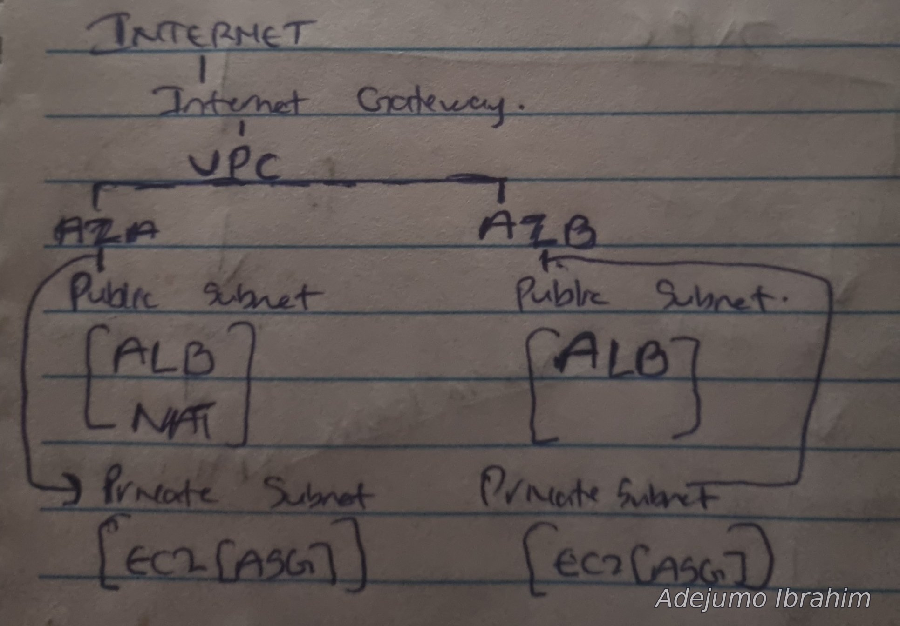

**Inbound:** Internet → Internet gateway → ALB (public subnets) → EC2 instances (private subnets)
**Outbound:** EC2 → NAT gateway (public subnet) → Internet gateway → Internet

Key design decisions:

- **Instances have no public IP.** They sit in private subnets, and the only way to reach them is through the ALB.
- **Security group chaining.** `EC2-SG` allows port 80 from the `ALB-SG` security group instead of an IP range. The ALB's IPs change as it scales, and the rule means nothing else in the VPC can reach the app port.
- **One NAT gateway** to keep costs down. Instances in both AZs route outbound traffic through it. In production I would add a second NAT in AZ B so an AZ A failure doesn't cut off outbound access.
- **No SSH or SSM.** I skipped shell access and configure the instances entirely through user data. Debugging is done through ALB health checks, target group status, and the instance system log.

## How my understanding of the design changed

I drew the architecture three times, and the first two were wrong in useful ways.

### Draft 1: network only
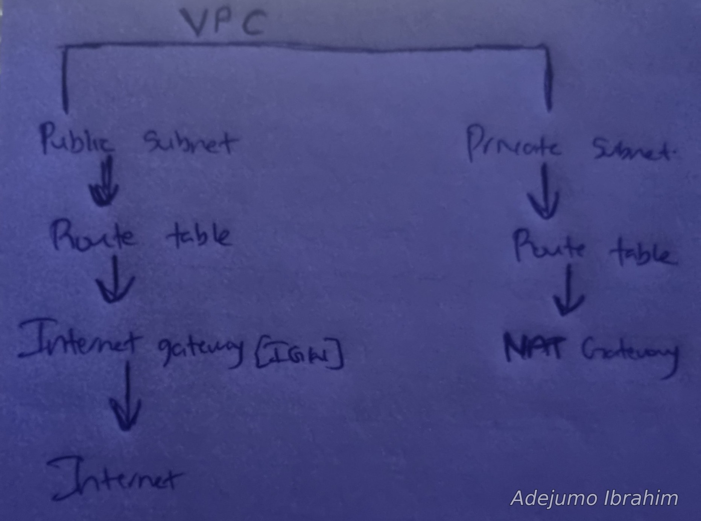

I started with the VPC, subnets, route tables, and gateways. The NAT gateway had no connections, and I wasn't sure where it should live.

### Draft 2: added more pieces, wrong structure
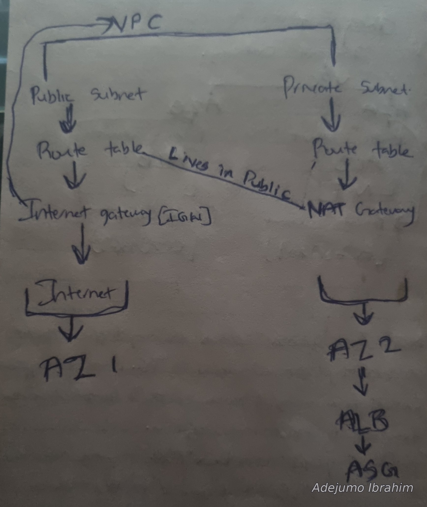

I learned the NAT gateway lives in the **public** subnet (it needs a route to the internet gateway), and I added the AZs, ALB, and ASG. But I drew them as steps in a chain (Internet → AZ 1, NAT → AZ 2 → ALB → ASG), as if traffic passed through an Availability Zone.

### Final: AZs are containers

An AZ is a location, not a step in a flow. Each AZ holds its own public and private subnet. The ALB is one load balancer with a node in each AZ, and the ASG spreads instances across the private subnets.

## Build steps

1. Created the VPC, 4 subnets (2 public, 2 private across 2 AZs), and an internet gateway attached to the VPC.
2. Created a public and a private route table, then associated each with its two subnets.
3. Added `0.0.0.0/0` → internet gateway to the public route table.
4. Created the NAT gateway in the `us-east-1a` public subnet with a new Elastic IP, and waited for **Available**.
5. Added `0.0.0.0/0` → NAT gateway to the private route table.
6. Created `ALB-SG` and `EC2-SG` (with `ALB-SG` as the source).
7. Created the launch template with user data.
8. Created the target group, then the ALB with the listener forwarding to it.
9. Created the Auto Scaling Group on the private subnets, attached to the target group, with ELB health checks on.
10. Added the CPU target tracking policy.

### Network

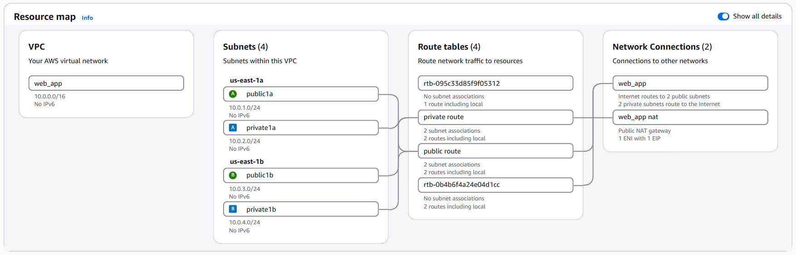

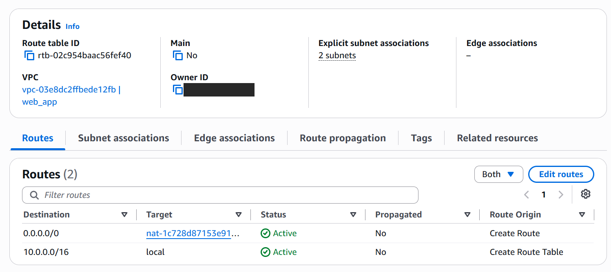

### Security groups

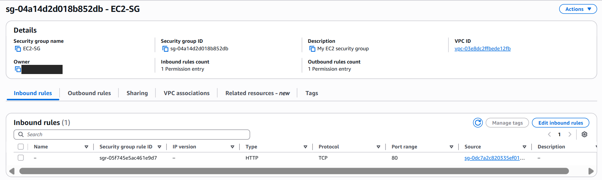

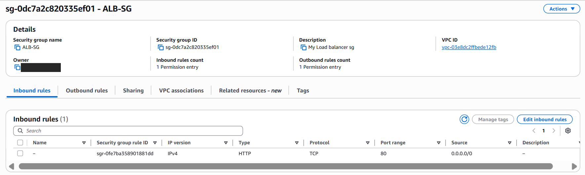

### Load balancer, target group, and ASG

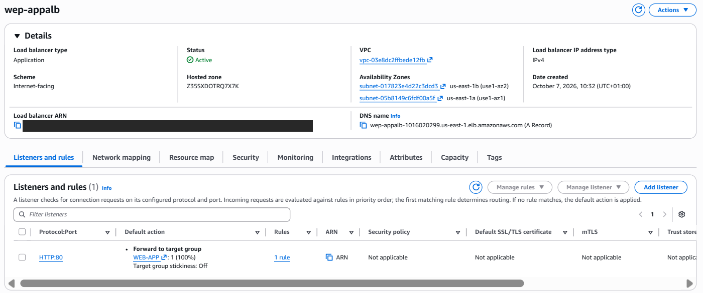

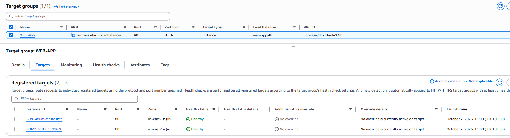

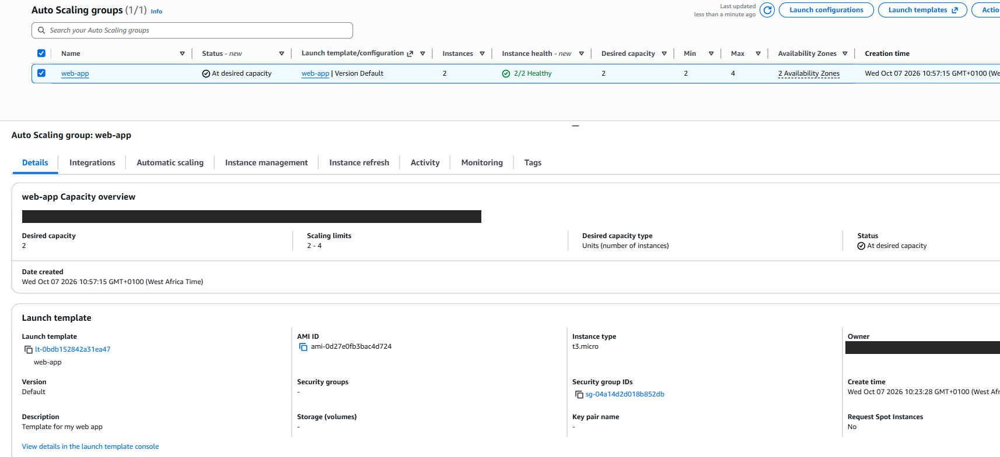

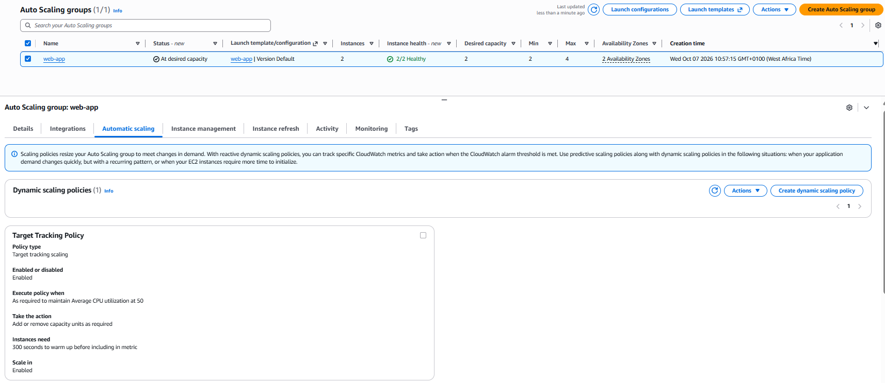

## Testing

### Load balancing across AZs

Refreshing the ALB's DNS name returned a page from a different instance and AZ.

### Self-healing

I terminated the instance in `us-east-1b` (`i-0f41aa97...`). The ALB kept serving from the instance in `us-east-1a`, and the ASG launched a replacement within seconds (`i-093486a5...`) to get back to the desired capacity of 2.

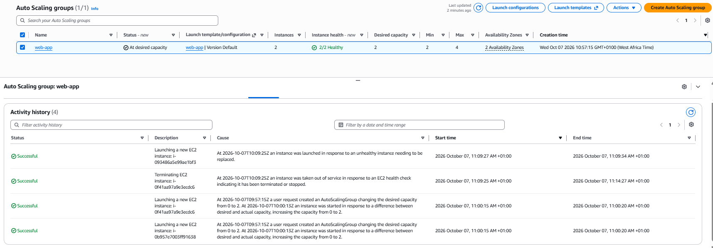

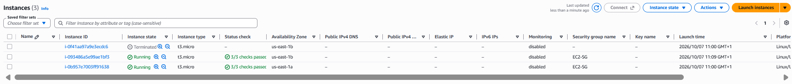

The instance list also confirms the instances have no public IPv4 address.

### Scaling policy

The target tracking policy is configured (CPU at 50%, min 2, max 4). I did **not** load-test it, so scale-out under real load is untested.

## Issues and lessons

- **Targets showed unhealthy right after launch.** Both instances were unhealthy for the first couple of minutes, then turned healthy on their own. The cause was user data still installing Apache. The ASG health check grace period (300 s) exists for exactly this.

  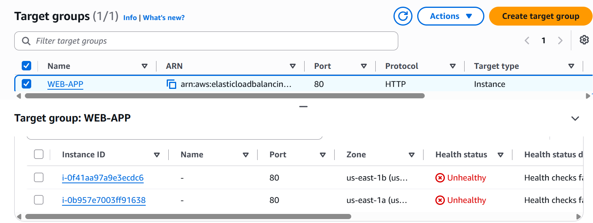

- **AZs are containers, not steps.** The biggest conceptual fix, covered in the drawings above.
- **The NAT gateway belongs in a public subnet.** It needs its own route to the internet gateway to forward traffic for the private subnets.
- **The ALB doesn't scale instances.** It only distributes traffic. The ASG controls how many instances exist, and the target group connects the two.
- **A security group isn't "in" a subnet.** It attaches to a resource's network interface, which is why the ALB and the instances each get their own.

## Cost and teardown

The NAT gateway and the ALB bill hourly, so I tear everything down after documenting. Order matters:

1. Auto Scaling Group (terminates the instances)
2. Application Load Balancer, then the target group
3. NAT gateway, then release its Elastic IP
4. VPC (removes the subnets, route tables, and internet gateway with it)

## What I would improve

- Add a second NAT gateway in AZ B for outbound resilience.
- Terminate HTTPS on the ALB with an ACM certificate and a custom domain.
- Add Session Manager (SSM) access instead of having no shell access.
- Load-test the scaling policy and capture the scale-out event.
- Rebuild the same stack with Terraform or CloudFormation.

